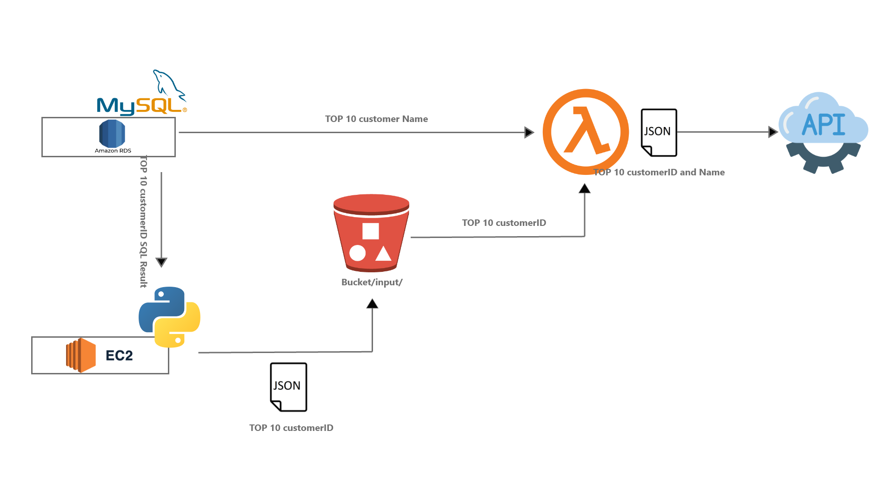

### Infrastructure:

### Steps:

1. Create RDS instance (I chose MySQL). Then connect the instance with the MySQL Workbench and load this file -> 'load-superstore-data.sql'.
2. use "init.sh" to run the program
    * "run.py" is the script to do main work
3. folder "lambda_script" contains the files will be used in AWS Lambda
    * 'lambda_function.py' is the script used to run lambda function
    * a layer needs to be added to the Lambda function - I uploaded the zip file (you can find it in lambda_script/lambda_layer_upload_to_s3) to s3 bucket, and then pointed to that zip file when added the layer to my Lambda. 
    
**Be aware of all the .env and config files are missing from the repo for security purposes.
